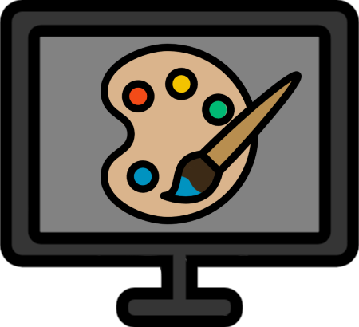

<!--
*** Thanks for checking out the Best-README-Template. If you have a suggestion
*** that would make this better, please fork the repo and create a pull request
*** or simply open an issue with the tag "enhancement".
*** Don't forget to give the project a star!
*** Thanks again! Now go create something AMAZING! :D
-->

<!-- PROJECT SHIELDS -->
<!--
*** I'm using markdown "reference style" links for readability.
*** Reference links are enclosed in brackets [ ] instead of parentheses ( ).
*** See the bottom of this document for the declaration of the reference variables
*** for contributors-url, forks-url, etc. This is an optional, concise syntax you may use.
*** https://www.markdownguide.org/basic-syntax/#reference-style-links
-->

<!-- PROJECT LOGO -->
 

  

  <h3 align="center">Komishon</h3>

  

    Track your art and commissions more efficiently with Komishon!
     
    <a href="https://github.com/erayalkis/komishon/tree/master/docs"><strong>Explore the docs »</strong></a>
     
     
    <a href="https://github.com/erayalkis/komishon/issues">Report Bug</a>
    ·
    <a href="https://github.com/erayalkis/komishon/issues">Request Feature</a>
  

<!-- TABLE OF CONTENTS -->

  
Table of Contents

  <ol>
    <li>
      <a href="#about-the-project">About Komishon</a>
      <ul>
        <li><a href="#built-with">Built With</a></li>
      </ul>
    </li>
    <li>
      <a href="#getting-started">Getting Started</a>
      <ul>
        <li><a href="#prerequisites">Prerequisites</a></li>
        <li><a href="#installation">Installation</a></li>
      </ul>
    </li>
    <li><a href="#roadmap">Roadmap</a></li>
    <li><a href="#contributing">Contributing</a></li>
    <li><a href="#license">License</a></li>
    <li><a href="#acknowledgments">Acknowledgments</a></li>
  </ol>

<!-- ABOUT THE PROJECT -->

## About The Project

Komishon is an app for efficiently tracking commissions while keeping your files organized.
With features such as tagging for easy organization, and deadline reports for quick reminders for catching up on work, Komishon makes tracking your projects easier.

Komishon is currently in early development and many features will be updated and changed.
Don't forget to give the project a star, as it keeps us motivated to make it better! Thanks again!

(<a href="#readme-top">back to top</a>)

### Built With

- [![Vue][vue.js]][vue-url]
- [![Tauri][tauri]][tauri-link]
- [![Rust][rust-lang]][rust-link]
- [![SQLite][sqlite]][sqlite-link]

(<a href="#readme-top">back to top</a>)

<!-- GETTING STARTED -->

## Getting Started

Thank you for your interest in using Komishon!

To get started, you can import a folder by using the import button on the top right section of the app.
After you import a folder, Komishon will watch it for changes, and apply any changes made to it - and any files inside it -.
This means, if you rename a folder, delete any file inside it, rename any file inside it, etc, Komishon will apply those changes instantly.

To favorite a folder or a file, you may use the heart icon on them, or right click on them to favorite through the context menu.

To apply Tags and Deadlines to a file, simply right click on it, and go to the Tags/Deadlines section, where you can find the option to add a new Tag/Deadline.

### Installation

To get Komishon running locally, first clone the repo:

`git clone git@github.com:erayalkis/komishon.git`

Then, navigate to the project's root, and install all the necessary JavaScript packages by running:

`npm install`

And finally, build and run the app by using:

`npm run tauri dev`

### Prerequisites

To build, test and run the backend code for Komishon, start by installing Rust by following the guide on the offical [Rust Website](https://www.rust-lang.org/tools/install).

Then, ensure that you have the necessary libraries for running Tauri:

On Windows - which is currently the only supported operating system - you will need:

- [Microsoft Visual Studio C++ Build Tools](https://visualstudio.microsoft.com/visual-cpp-build-tools/)
- [WebView2](https://developer.microsoft.com/en-us/microsoft-edge/webview2/#download-section)
  - If you are running Windows 11, you can skip this step, as WebView2 is pre-installed on Windows 11

(<a href="#readme-top">back to top</a>)

<!-- ROADMAP -->

## Roadmap

**Before v1.0:**

- [x] Add changelogs to releases
- [x] Refactor code
- [x] Revamp UI
- [x] Add notifications

**After v1.0:**

- [ ] Add drag and drop functionality for moving files
- [ ] Add more actions to context menu
- [ ] Update search functions
- [ ] Improve UI design

See the [open issues](https://github.com/erayalkis/komishon/issues) for a full list of proposed features (and known issues).

(<a href="#readme-top">back to top</a>)

<!-- CONTRIBUTING -->

## Contributing

Contributions are what make the open source community such an amazing place to learn, inspire, and create. Any contributions you make are **greatly appreciated**!

If you have a suggestion that would make Komishon better, please create a new issue, or fork the repo and create a pull request.

1. Fork the Project
2. Create your Feature Branch (`git checkout -b feature/AmazingFeature`)
3. Commit your Changes (`git commit -m 'Add some AmazingFeature'`)
4. Push to the Branch (`git push origin feature/AmazingFeature`)
5. Open a Pull Request

(<a href="#readme-top">back to top</a>)

<!-- LICENSE -->

## License

Distributed under the GNU General Public License. See `LICENSE.md` for more information.

(<a href="#readme-top">back to top</a>)

<!-- ACKNOWLEDGMENTS -->

## Acknowledgments

- [Img Shields](https://shields.io)
- [Feather Icons](https://feathericons.com)

(<a href="#readme-top">back to top</a>)

<!-- MARKDOWN LINKS & IMAGES -->
<!-- https://www.markdownguide.org/basic-syntax/#reference-style-links -->

[product-screenshot]: images/screenshot.png
[vue.js]: https://img.shields.io/badge/Vue.js-35495E?style=for-the-badge&logo=vuedotjs&logoColor=4FC08D
[vue-url]: https://vuejs.org/
[sqlite]: https://img.shields.io/badge/sqlite-%2307405e.svg?style=for-the-badge&logo=sqlite&logoColor=white
[sqlite-link]: https://www.sqlite.org/index.html
[tauri]: https://img.shields.io/badge/tauri-%2324C8DB.svg?style=for-the-badge&logo=tauri&logoColor=%23FFFFFF
[tauri-link]: https://tauri.app
[rust-lang]: https://img.shields.io/badge/rust-%23000000.svg?style=for-the-badge&logo=rust&logoColor=white
[rust-link]: https://www.rust-lang.org
